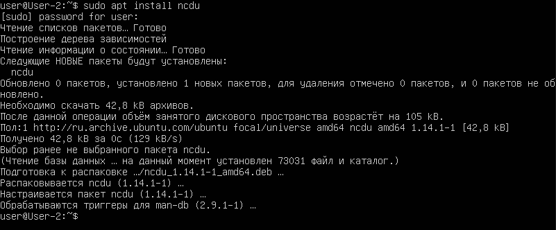

# D01_Linux-1

## Part 1. Установка ОС

**== Задание ==**

##### Установи **Ubuntu 20.04 Server LTS** без графического интерфейса. (Используем программу для виртуализации - VirtualBox)

- Графический интерфейс должен отсутствовать.

- Узнай версию Ubuntu, выполнив команду \
`cat /etc/issue`
- Вставь скриншот с выводом команды.

**== Решение ==**
 

## Part 2. Создание пользователя

`-` Установленная система -- это хорошо, но вдруг ей будет пользоваться кто-то ещё? Сейчас научу тебя созданию нового пользователя.

**== Задание ==**

##### Создай пользователя, отличного от созданного при установке. Пользователь должен быть добавлен в группу `adm`.

- Вставь скриншот вызова команды для создания пользователя.
- Новый пользователь должен быть в выводе команды \
`cat /etc/passwd`
- Вставь скриншот с выводом команды.

**== Решение ==**

Для создания пользователя и добавления его в группу `adm` нужно использовать команду `sudo useradd наименование пользователя -G adm`

 
 
 Скриншот вывода нового пользователя командой `cat /etc/passwd`

  

## Part 3. Настройка сети ОС

`-` В нашем мире без интернета далеко не уедешь. Однако поскольку мы хотим подготовить тебя к роли системного администратора, я покажу немного больше, чем просто настройку сети.

`-` Перед тем, как приступим, советую почитать про сетевые интерфейсы и DHCP.

**== Задание ==**

##### Задай название машины вида user-1.
##### Установи временную зону, соответствующую твоему текущему местоположению.  
##### Выведи названия сетевых интерфейсов с помощью консольной команды.
- В отчёте дай объяснение наличию интерфейса lo.  
##### Используя консольную команду, получи ip адрес устройства, на котором ты работаешь, от DHCP сервера. 
- В отчёте дай расшифровку DHCP.  
##### Определи и выведи на экран внешний ip-адрес шлюза (ip) и внутренний IP-адрес шлюза, он же ip-адрес по умолчанию (gw). 
##### Задай статичные (заданные вручную, а не полученные от DHCP сервера) настройки ip, gw, dns (используй публичный DNS серверы, например 1.1.1.1 или 8.8.8.8).  
##### Перезагрузи виртуальную машину. Убедись, что статичные сетевые настройки (ip, gw, dns) соответствуют заданным в предыдущем пункте.  

- В отчёте опиши, что сделал для выполнения всех семи пунктов (можно как текстом, так и скриншотами).
- Успешно пропингуй удаленные хосты 1.1.1.1 и ya.ru и вставь в отчёт скрин с выводом команды. В выводе команды должна быть фраза «0% packet loss».

**== Решение ==**
Узнаем текушее название сервера командой `hostnamectl`:

 

Смена наименования сервера командой `sudo hostnamectl set-hostname user-1` и выводим новое наименование сервера `hostnamectl`

 

Проверка нынешней временной зоны командой `timedatectl`

 

Установка временной зоны соответствующая моему текущему местоположению командой `sudo timedatectl set-timezone Europe/Moscow`

 

Выведение названия сетевых интерфейсов с помощью команды `ip link show`

lo (loopback device) – виртуальный интерфейс, присутствующий по умолчанию в любом Linux. Он используется для отладки сетевых программ и запуска серверных приложений на локальной машине.

 

Используя консольную команду `ip addr show`, получил ip адрес устройства, на котором работаю, от DHCP сервера

DHCP — это протокол прикладного уровня, который помогает назначать IP-адреса устройствам при подключении к серверу. Протокол DHCP автоматизирует выдачу адресов, а также их передачу следующим пользователям после отключения устройств или их перехода из одной подсети в другую.

 

Определение и выведение на экран внешнего ip-адрес шлюза (ip) командой `ip route`

 
 
 
 
Определение и выведение на экран внутреннего IP-адрес шлюза командой `curl ifconfig.me`

 

Редактируем файл настройки сети чтобы задать статичные настройки:

 

Для применения настроек вводим команду: `sudo netplan apply`

 

Перезагрузка виртуальной машины командой `reboot`

 

Успешно пропинговал удаленные хосты 1.1.1.1, 8.8.8.8 и ya.ru.В выводе команды емеется фраза «0% packet loss».

 

## Part 4. Обновление ОС

`-` Ты спросишь меня: «Готова ли теперь система?». Не готова она совсем! Мы же ещё не обновили её до последней версии.

**== Задание ==**

##### Обнови системные пакеты до последней на момент выполнения задания версии.  

- После обновления системных пакетов, если ввести команду обновления повторно, должно появиться сообщение, что обновления отсутствуют;
- Вставь скриншот с этим сообщением в отчёт.

**== Решение ==**
Обновление системы пакетов командой `sudo apt full-upgrade`

 

Проверяем, что обновлений не осталось и все обновления установлены командой `sudo apt full-upgrade`

 

## Part 5. Использование команды **sudo**

`-` Как часто тебе в детстве говорили, что ты забыл сказать «волшебное слово»? Одним из таких «волшебных слов» было «пожалуйста». В Linux есть его аналог - _sudo_. Система не станет выполнять некоторые операции, пока не услышит «волшебное слово».

**== Задание ==**

##### Разреши пользователю, созданному в [Part 2](#part-2-создание-пользователя),выполнять команду sudo.

- В отчёте объясни *истинное* назначение команды sudo (про то, что это слово - «волшебное», писать не стоит);  
- Поменяй hostname ОС от имени пользователя, созданного в пункте [Part 2](#part-2-создание-пользователя) (используя sudo);
- Вставь скрин с изменённым hostname в отчёт.

**== Решение ==**

Разрешаем пользователю, созданному в Part 2,выполнять команду `sudo`

 

Поменял hostname ОС от имени пользователя, созданного в пункте [Part 2] 

 

## Part 6. Установка и настройка службы времени

`-` Хоть у нас сейчас и стоит правильное время, оно может быть таким не всегда. Чтобы не настраивать его каждый раз самим, существуют службы синхронизации времени.

**== Задание ==**

##### Настрой службу автоматической синхронизации времени.  

- Выведи время часового пояса, в котором ты сейчас находишься.
- Вывод следующей команды должен содержать `NTPSynchronized=yes`: \
  `timedatectl show`
- Вставь скрины с корректным временем и выводом команды в отчёт.

**== Решение ==**
Командой `timedatectl show` проверяем содержание надписи `NTPSynchronized=yes`

 

## Part 7. Установка и использование текстовых редакторов 

`-` Думаю, мы готовы перейти к одному из самых страшных этапов. 

На висящей на стене карте мира ты указываешь в сторону Нидерландов:

`-` Здесь Брам Моленар разгадал тайны гармонии и внутренней концентрации. \
Именно здесь 2 ноября 1991 года вышла первая версия VIM. \
Ты хочешь научиться работать в VIM?

`-` Да.

`-` Тогда я и есть твой мастер.

`-` Хорошо...

`-` Только не плачь.

`-` Ладно...

**== Задание ==**

##### Установи текстовые редакторы **VIM** (+ любые два по желанию **NANO**, **MCEDIT**, **JOE** и т.д.)  
##### Используя каждый из трех выбранных редакторов, создай файл *test_X.txt*, где X -- название редактора, в котором создан файл. Напиши в нём свой никнейм, закрой файл с сохранением изменений.  
- В отчёт вставь скриншоты:
  - Из каждого редактора с содержимым файла перед закрытием;
- В отчёте укажи, что сделал для выхода с сохранением изменений.
##### Используя каждый из трех выбранных редакторов, открой файл на редактирование, отредактируй файл, заменив никнейм на строку «21 School 21», закрой файл без сохранения изменений.
- В отчёт вставь скриншоты:
    - Из каждого редактора с содержимым файла после редактирования;
- В отчёте укажи, что сделал для выхода без сохранения изменений.
##### Используя каждый из трех выбранных редакторов, отредактируй файл ещё раз (по аналогии с предыдущим пунктом), а затем освой функции поиска по содержимому файла (слово) и замены слова на любое другое.
- В отчёт вставь скриншоты:
    - Из каждого редактора с результатами поиска слова;
    - Из каждого редактора с командами, введёнными для замены слова на другое.

**== Решение ==**

##### Установил текстовые редакторы **VIM**, **NANO**, **MCEDIT**, **JOE**.

 

##### Используя vim  редактор, создан файл *test_vim.txt*, и написал в нём свой никнейм, закрыл файл с сохранением изменений используя команду `:wq`.  

 

##### Используя nano  редактор, создан файл *test_nano.txt*, и написал в нём свой никнейм, закрыл файл с сохранением изменений используя команду `ctrl o` и `ctrl x`.

 

##### Используя mkedit  редактор, создан файл *test_mkedit.txt*, и написал в нём свой никнейм, закрыл файл с сохранением изменений используя команду `f2`

 

##### Используя vim  редактор, открыл файл на редактирование, отредактировал файл, заменил никнейм на строку «21 School 21» командой `q!`, закрыл файл без сохранения изменений.

 

##### Используя nano  редактор, открыл файл на редактирование, отредактировал файл, заменил никнейм на строку «21 School 21» командой `ctrl x` и `N`, закрыл файл без сохранения изменений.

 

##### Используя mkedit  редактор, открыл файл на редактирование, отредактировал файл, заменил никнейм на строку «21 School 21» командой `F10` и `НЕТ`, закрыл файл без сохранения изменений.

 

##### Используя каждый из трех редакторов, отредактировал файл ещё раз (по аналогии с предыдущим пунктом), а затем освоил функции поиска по содержимому файла (слово) и менял слова на другое.

Для поиска слова в редакторе Vim используется знак `/(слово для поиска)`:

 

Для замены слова в редакторе Vim используется символы :s(слово для замены/ заменяемое слово):

 

Для поиска слова в редакторе nano используется команда `ctrl + W`:

 

Для замены слова в редакторе nano используется команда `ALT + R`:

 

 

Для поиска слова в редакторе mkedit используется команда `f7`:

 

Для замены слова в редакторе mkedit используется команда `f4`:

 

## Part 8. Установка и базовая настройка сервиса **SSHD**

`-` Удобно иметь доступ от одного компьютера к другому по сети, правда? Но чтобы это было не только удобно, но и безопасно, стоит использовать сервис SSH.

**== Задание ==**

##### Установи службу SSHd.  
##### Добавь автостарт службы при загрузке системы.  
##### Перенастрой службу SSHd на порт 2022.  
##### Используя команду ps, покажи наличие процесса sshd. Для этого к команде нужно подобрать ключи.
- В отчёте объясни значение команды и каждого ключа в ней.
##### Перезагрузи систему.
- В отчёте опиши, что сделал для выполнения всех пяти пунктов (можно как текстом, так и скриншотами).
- Вывод команды netstat -tan должен содержать  \
`tcp 0 0 0.0.0.0:2022 0.0.0.0:* LISTEN`  \
(если команды netstat нет, то ее нужно установить)
- Скрин с выводом команды вставь в отчёт.
- В отчёте объясни значение ключей -tan, значение каждого столбца вывода, значение 0.0.0.0.

**== Решение ==**

##### Установил службу SSHd командой `sudo apt install openssh-server`:

 

##### Узнаем статус службы командой `sudo systemctl status ssh`:

 

##### Из вывода терминала видно что служба запускается автоматически, для  автоматического включения службы нужно ввести команду `sudo systemctl enable ssh`:

##### Перенастроем службу SSHd на порт 2022, для этого отредактируем конфигурационный файл SSH, чтобы изменить порт по умолчанию с 20 на 2022 командой `sudo nano /etc/ssh/sshd_config`:

 

##### Перезапустим службу SSH, чтобы применить изменения командой `sudo systemctl restart ssh`:

 

Проверим изменился ли порт после команды `sudo systemctl status ssh`:

 

Используя команду `ps -ef`, покажем наличие процесса `grep -sshd`.

 

Значение ключей:

-e: показывает все процессы.
-f: показывает полную информацию о процессах.
| grep sshd: фильтрует вывод, показывая только строки, содержащие sshd.

##### Перезагрузаем систему командой `reboot`.

##### Устанавливаем `netstat` и выводим результат команды `netstat -tan`:

 

Значение ключей -tan:
  - -t: Показать только TCP-соединения.
  - -a: Показать все соединения и сокеты, включая те, что находятся в состоянии прослушивания (LISTEN).
  - -n: Показать числовые значения IP-адресов и портов, без попытки их разрешения в имена.

Значение 0.0.0.0:
  - 0.0.0.0: Специальный IP-адрес, означающий "все IPv4-адреса" на локальной машине. Если служба слушает на 0.0.0.0, это значит, что она принимает соединения на всех сетевых интерфейсах.

- Proto — протокол (tcp, udp, raw), используемый сокетом.
- Recv-Q — количество байтов, не скопированных локальным приложением.
- Send-Q — количество байтов, не подтвержденных удаленным хостом.
- Local Address — адрес и номер порта локального конца сокета.
- Foreign Address — адрес и номер порта удаленного конца сокета.
- State: Состояние соединения.

## Part 9. Установка и использование утилит **top**, **htop**

`-` Если бы меня спросили, что полезного делают утилиты **top** и **htop**, я бы ответил одним словом - всё.

**== Задание ==**

##### Установи и запусти утилиты top и htop.  

- По выводу команды top определи и напиши в отчёте:
  - uptime
  - количество авторизованных пользователей
  - общую загрузку системы
  - общее количество процессов
  - загрузку cpu
  - загрузку памяти
  - pid процесса занимающего больше всего памяти
  - pid процесса, занимающего больше всего процессорного времени
- В отчёт вставь скрин с выводом команды htop:
  - отсортированному по PID, PERCENT_CPU, PERCENT_MEM, TIME
  - отфильтрованному для процесса sshd
  - с процессом syslog, найденным, используя поиск 
  - с добавленным выводом hostname, clock и uptime  

  **== Решение ==**

Запускаем утилиту `top`:

   

  - uptime - 25 минут;
  - количество авторизованных пользователей - 1 пользователь;
  - общую загрузку системы - 0.00;
  - общее количество процессов - 98;
  - загрузку памяти - 150.0 из 3920.2;
  - загрузку cpu - 0.0;
  - pid процесса занимающего больше всего памяти - 1;
  - pid процесса, занимающего больше всего процессорного времени - 1;

  ## Вывод команды htop:

- Для сортировки по `PID` нажимаем `F6` и выбераем `PID`:

 

- Для сортировки по `PERCENT_CPU` нажимаем `F6` и выбераем `PERCENT_CPU`:

 

- Для сортировки по `PERCENT_MEM` нажимаем `F6` и выбераем `PERCENT_MEM`:

 

-  Для сортировки по `TIME` нажимаем `F6` и выбераем `TIME`:

 

- Для фильтрации по процессу `sshd`нажимаем `F4` и вводим `sshd`:

 

- Для поиска процесса `syslog`, нажимаем `F3` и вводим `syslog`:

 

- Добавляем `hostname`, `clock`и `uptime`:

 

## Part 10. Использование утилиты **fdisk**

`-` Теперь давай разберёмся, как получить информацию о жёстком диске. Специально для тебя я собрал пару примеров работы с утилитой fdisk.

**== Задание ==**

##### Запусти команду fdisk -l.

- В отчёте напиши название жесткого диска, его размер и количество секторов, а также размер swap.

**== Решение ==**

##### Запустим команду sudo fdisk -l:

 

- Название жесткого диска - VBOX HARDDISK;
- Размер - 10 Gib;
- Количество секторов - 20971520;
- Чтобы посмотреть размер swap используем команду free -h:

 

Из вывода терминала видим что размер swap 0 B.

## Part 11. Использование утилиты **df** 

`-` Информацию о жёстком диске мы получили, но, зачастую, куда интереснее информация о дисковом пространстве, которую можно получить с помощью утилиты df.

**== Задание ==**

##### Запусти команду df.  
- В отчёте напиши для корневого раздела (/):
  - размер раздела
  - размер занятого пространства
  - размер свободного пространства
  - процент использования
- Определи и напиши в отчёт единицу измерения в выводе.  

##### Запусти команду df -Th.
- В отчёте напиши для корневого раздела (/):
    - размер раздела
    - размер занятого пространства
    - размер свободного пространства
    - процент использования
- Определи и напиши в отчёт тип файловой системы для раздела.

**== Решение ==**

##### Запустим команду `df`:

 

- Запишем данные с корневого раздела (/):
  - размер раздела - 8408452;
  - размер занятого пространства - 2810844;
  - размер свободного пространства - 5148892;
  - процент использования - 36%;
- Единица измерения в выводе - килобайты.

##### Запустим команду `df -Th`:

 

- Запишем данные с корневого раздела:
  - размер раздела - 8,1 G;
  - размер занятого пространства - 2,7 G;
  - размер свободного пространства - 5 G;
  - процент использования - 36 %;
- Тип файловой системы для раздела - ext4.

## Part 12. Использование утилиты **du**

`-` df - не единственный способ получить информацию о дисковом пространстве. Сейчас расскажу про ещё один.

**== Задание ==**

##### Запусти команду du
##### Выведи размер папок /home, /var, /var/log (в байтах, в человекочитаемом виде)
##### Выведи размер всего содержимого в /var/log (не общее, а каждого вложенного элемента, используя *)

- В отчёт вставь скрины с выводом всех использованных команд.

**== Решение ==**

##### Запустим команду `du`

 

##### Выведем размер папки `do -b /home` в байтах:

 

##### Выведем размер папки ` do -h /home` в человекочитаемом виде:

 

##### Выведем размер папки `do -b /var` в байтах:

 

##### Выведем размер папки `do -h /var` в человекочитаемом виде:

 

##### Выведем размер папки `do -b /var/log` в байтах:

 

##### Выведем размер папки `do -h /var/log` в человекочитаемом виде:

 

##### Выведем размер всего содержимого в `sudo do -sh /var/log`, используя `/*`:

 

## Part 13. Установка и использование утилиты **ncdu**

`-` Тебе, возможно, не очень понравился формат, в котором команда du выводит информацию. Я тебя прекрасно понимаю. Поэтому сейчас мы рассмотрим её улучшенную версию.

**== Задание ==**

##### Установи утилиту ncdu
##### Выведи размер папок /home, /var, /var/log

- Размеры должны примерно совпадать с полученными в [Part 12](#part-12-использование-утилиты-du).

- В отчёт вставь скрины с выводом использованных команд.

**== Решение ==**

##### Установим утилиту `ncdu` командой `sudo apt install ncdu`:

 

##### Выведим размер папки `ncdu /home`:

 

##### Выведим размер папки `ncdu /var`:

 

##### Выведим размер папки `ncdu /var/log`:

 

## Part 14. Работа с системными журналами

`-` Системному администратору иногда приходится просматривать события, происходившие в системе в недавнем прошлом. Для этого в Linux есть системные журналы.

**== Задание ==**

##### Открой для просмотра:
##### 1. /var/log/dmesg
##### 2. /var/log/syslog
##### 3. /var/log/auth.log  

- Напиши в отчёте время последней успешной авторизации, имя пользователя и метод входа в систему;
- Перезапусти службу SSHd;
- Вставь в отчёт скрин с сообщением о рестарте службы (искать в логах).

**== Решение ==**

##### Откроем для просмотра `/var/log/dmesg` командой `less`:

 

##### Откроем для просмотра `/var/log/syslog` командой `less`:

 

##### Откроем для просмотра `/var/log/auth.log` командой `less`:

 

- Запишем данные с журналов:
  - Время последней успешной авторизации - Aug 17 19:08:58;
  - Имя пользователя - user;
  - Метод входа в систему - pam_unix.
- Перезапустим службу SSHd:

 

- Вставим скрин с сообщением о рестарте службы:

 

## Part 15. Использование планировщика заданий **CRON**

`-` Фух, наконец-то мы добрались до последней части моего долгого повествования. Сейчас я покажу программу, которая, помимо прочего, заметно упрощает периодический вызов других программ.

**== Задание ==**

##### Используя планировщик заданий, запусти команду uptime через каждые 2 минуты.
- Найди в системных журналах строчки (минимум две в заданном временном диапазоне) о выполнении;
- Выведи на экран список текущих заданий для CRON;
- Вставь в отчёт скрины со строчками о выполнении и списком текущих задач.

##### Удали все задания из планировщика заданий.
- В отчёт вставь скрин со списком текущих заданий для CRON.

**== Решение ==**

##### Используя планировщик заданий, запустим команду `uptime` через каждые 2 минуты:
Откроем `CRON` для редактирования с комощью команды `crontab -e` и нажмем `5` для продолжения:

 

Отредактируем файл чтобы команда `uptime` запускалась через каждые 2 минуты:

 

- Находим в системных журналах строчки о выполнении:

 

- Выведем на экран список текущих заданий для `CRON` командой `crontab -l`:

 

##### Удалим все задания из планировщика заданий командой `crontab -r`:

 
